# TABLE OF CONTENTS
***
* [Overview](#overview)
* [Deployment](#deployment)
* [Installation](#installation)
* [User Interface](#user-interface)
* [Development History](#development-history)
* [The Team](#the-team)

 
## Overview 
 Aloha-time makes it easy for volunteers to find organizations in need, and for organizations to find qualified volunteers. It can be based on a volunteer's interest or hobby and other situations to find a suitable organization that benifits organziation and volunteer to finish task more easier and faster. For example, some volunteer prefer to remote work due to COVID-19, Aloha-time can prevent that those volunteers get a face to face task.   In addition, Aloha-Time tracks and records the time you volunteer to help others, even though this non-profit, excellent volunteers should be known and respected. 
 
  The goals of our project is to answer these questions:
 * Which organization needs more volunteers?
 * How to match the organization with the volunteers?
 
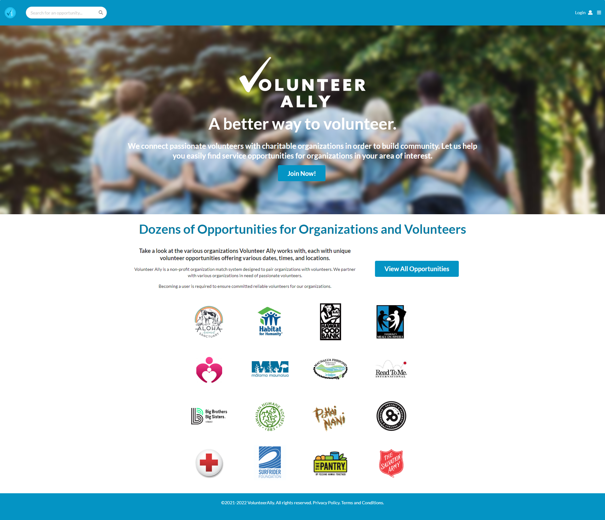

## Deployment

The website has been deployed with Digital Ocean and can be accessed through the following link:

https://aloha-time.xyz/#/

## Installation

First, [install Meteor](https://www.meteor.com/install).

Second, go to [https://github.com/aloha-time/aloha-time](https://github.com/aloha-time/aloha-time), and click the "Use this template" button. Complete the dialog box to create a new repository that you own that is initialized with this template's files.

Third, go to your newly created repository, and click the "Clone or download" button to download your new GitHub repo to your local file system.  Using [GitHub Desktop](https://desktop.github.com/) is a great choice if you use MacOS or Windows.

Fourth, cd into the app/ directory of your local copy of the repo, and install third party libraries with:

```
$ meteor npm install
```

## Running the system

Once the libraries are installed, you can run the application by invoking the "start" script in the [package.json file](https://github.com/aloha-time/aloha-time/blob/main/app/package.json):

```
$ meteor npm run start
```

The first time you run the app, it will create some default users and data. Here is the output:

```
⋊> ~/G/m/app on main ⨯ meteor npm run start


> meteor-application-template-react-production@1.0.3 start /Users/user/GitHub/aloha-time/app
> meteor --no-release-check --exclude-archs web.browser.legacy,web.cordova --settings ../config/settings.development.json

[[[[[ ~/GitHub/aloha-time/app ]]]]]                

=> Started proxy.                             
=> Started MongoDB.                           
I20220511-20:17:41.967(-10)? Creating the default user(s)
I20220511-20:17:42.041(-10)?   Creating user admin@foo.com with role ADMIN.
I20220511-20:17:42.105(-10)? Defining ADMIN admin@foo.com with password changeme
I20220511-20:17:42.108(-10)? Creating the default organization(s)
I20220511-20:17:42.108(-10)?   Creating organization HIFoodBank with role ORGANIZATION.
I20220511-20:17:42.218(-10)? Defining ORGANIZATION HIFoodBank with password changeme
I20220511-20:17:42.221(-10)?   Creating organization SaveTheAnimals with role ORGANIZATION.
I20220511-20:17:42.317(-10)? Defining ORGANIZATION SaveTheAnimals with password changeme
I20220511-20:17:42.319(-10)?   Creating organization HelpIsOnTheWay with role ORGANIZATION.
I20220511-20:17:42.411(-10)? Defining ORGANIZATION HelpIsOnTheWay with password changeme
I20220511-20:17:42.413(-10)?   Creating organization MakeAWishHI with role ORGANIZATION.
I20220511-20:17:42.502(-10)? Defining ORGANIZATION MakeAWishHI with password changeme
I20220511-20:17:42.504(-10)?   Creating organization AlohaAnimal with role ORGANIZATION.
I20220511-20:17:42.599(-10)? Defining ORGANIZATION AlohaAnimal with password changeme
I20220511-20:17:42.603(-10)?   Creating organization HUGS4Hawaii with role ORGANIZATION.
I20220511-20:17:42.693(-10)? Defining ORGANIZATION HUGS4Hawaii with password changeme
I20220511-20:17:42.695(-10)?   Creating organization BBBSHawaii with role ORGANIZATION.
I20220511-20:17:42.792(-10)? Defining ORGANIZATION BBBSHawaii with password changeme
I20220511-20:17:42.794(-10)?   Creating organization H4H with role ORGANIZATION.
I20220511-20:17:42.887(-10)? Defining ORGANIZATION H4H with password changeme
I20220511-20:17:42.889(-10)?   Creating organization Malama with role ORGANIZATION.
I20220511-20:17:42.982(-10)? Defining ORGANIZATION Malama with password changeme
I20220511-20:17:42.984(-10)?   Creating organization SaveTheBeaches with role ORGANIZATION.
I20220511-20:17:43.081(-10)? Defining ORGANIZATION SaveTheBeaches with password changeme
I20220511-20:17:43.082(-10)?   Creating organization Fishpond with role ORGANIZATION.
I20220511-20:17:43.177(-10)? Defining ORGANIZATION Fishpond with password changeme
I20220511-20:17:43.179(-10)?   Creating organization Care4TheElders with role ORGANIZATION.
I20220511-20:17:43.280(-10)? Defining ORGANIZATION Care4TheElders with password changeme
I20220511-20:17:43.284(-10)?   Creating organization Food4All with role ORGANIZATION.
I20220511-20:17:43.408(-10)? Defining ORGANIZATION Food4All with password changeme
I20220511-20:17:43.412(-10)?   Creating organization HMoW with role ORGANIZATION.
I20220511-20:17:43.529(-10)? Defining ORGANIZATION HMoW with password changeme
I20220511-20:17:43.531(-10)?   Creating organization Books4Kids with role ORGANIZATION.
I20220511-20:17:43.630(-10)? Defining ORGANIZATION Books4Kids with password changeme
I20220511-20:17:43.632(-10)?   Creating organization PaPHawaii with role ORGANIZATION.
I20220511-20:17:43.728(-10)? Defining ORGANIZATION PaPHawaii with password changeme
I20220511-20:17:43.730(-10)?   Creating organization SalvArmy with role ORGANIZATION.
I20220511-20:17:43.825(-10)? Defining ORGANIZATION SalvArmy with password changeme
I20220511-20:17:43.828(-10)? Creating the default Volunteer(s)
I20220511-20:17:43.828(-10)?   Creating volunteer Eric with role VOLUNTEER.
I20220511-20:17:43.932(-10)? Defining VOLUNTEER Eric with password changeme
I20220511-20:17:43.933(-10)?   Creating volunteer john@foo.com with role VOLUNTEER.
I20220511-20:17:44.025(-10)? Defining VOLUNTEER john@foo.com with password changeme
I20220511-20:17:44.031(-10)? Creating default opportunities.
I20220511-20:17:44.032(-10)?   Adding: Health Help (HelpIsOnTheWay)
I20220511-20:17:44.044(-10)?   Adding: Beach Cleanup (MakeAWishHI)
I20220511-20:17:44.048(-10)?   Adding: Food Drive (HIFoodBank)
I20220511-20:17:44.054(-10)?   Adding: Virtual Dog Walk (SaveTheAnimals)
I20220511-20:17:44.108(-10)? Monti APM: completed instrumenting the app
=> Started your app.

=> App running at: http://localhost:3000/
```


### Viewing the running app

If all goes well, the template application will appear at [http://localhost:3000](http://localhost:3000).  You can login using the credentials in [settings.development.json](https://github.com/aloha-time/aloha-time/blob/main/config/settings.development.json), or else register a new account.

### ESLint

You can verify that the code obeys our coding standards by running ESLint over the code in the imports/ directory with:

```
meteor npm run lint
```

## User Interface

#### Landing page

Upon visiting the site users are greeted with the following page that displays the various organizations that Volunteer Ally has partnered with to offer unique volunteer opportunities:


New users are encouraged to click the *Join Now* button to sign-up and become a volunteer. Otherwise, volunteers that already have an account can sign-in by clicking the *Login* link in the top-right corner. 

#### Sign-in page

Clicking on the Login link, then on the Sign In menu item displays this page:

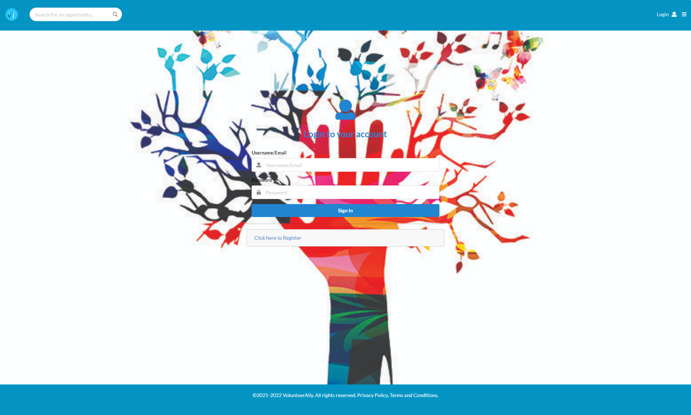

#### Sign-up page

Alternatively, new users can register to become a volunteer by filling out the following sign-up form with their information:


#### Browse Opportunities page (pre-verification)

After logging in as the volunteer profile *john@foo.com* we can then click on the *View All Opportunities* button on the landing page to see the various opportunities available:

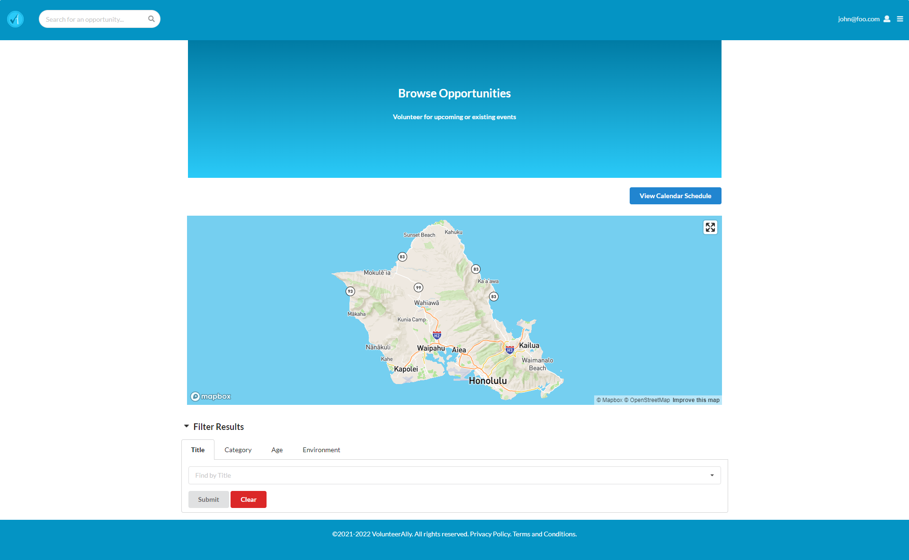

At the moment there are no opportunities displayed on the page. This is because the Admin has not yet verified any of the opportunities posted by the organizations. Let's sign-in as an Admin to verify them.

#### Admin page

The Admin has extensive control of the site. This page allows them to manage their own account, remove organization and volunteer accounts, and remove or verify opportunities:

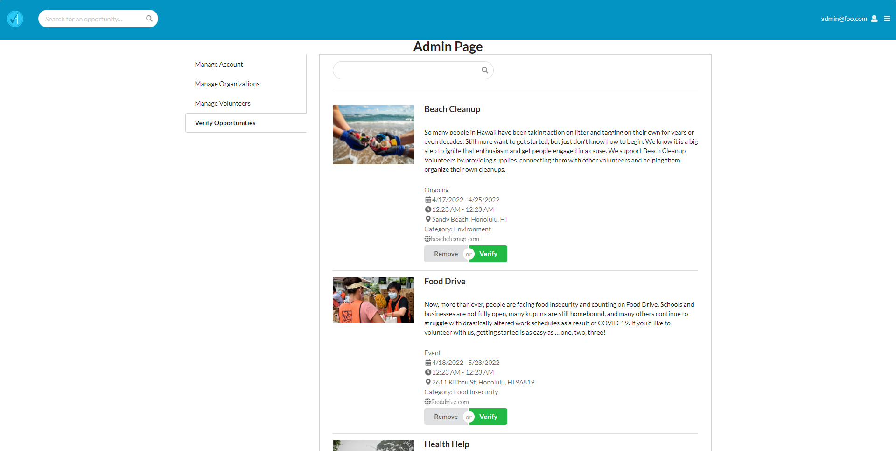

As stated previously, we wanted to verify the different opportunities created by the organizations, so they can be posted on the Browse Opportunities page.

#### Browse Opportunities page (post-verification)

Once we have clicked the *Verify* button for all the pending opportunities we can then return to the Browse Opportunities page to see them:

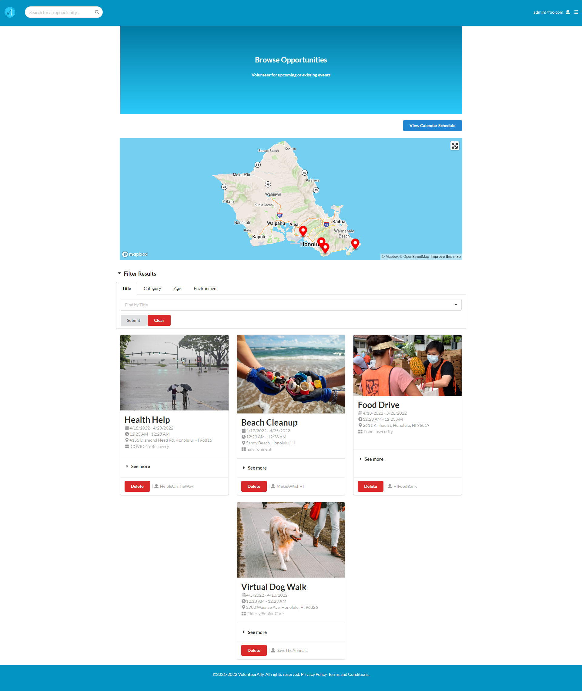

Opportunities are listed as cards with a short summary about them. If you are interested in an opportunity you can click on the image to view further details about the listing.

Note that we are still logged in as the Admin. As such, each opportunity card displays a *Delete* button and their owner at the bottom. These are not visible if logged in with a volunteer or organization account.

##### Filter 

Opportunities can be filtered by their title, category, age-group and environment type:

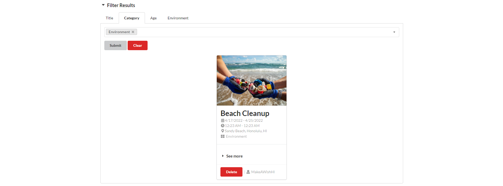

##### Map

Opportunities are also displayed on the map as markers. These markers are clickable and clicking on one will display their opportunity card:

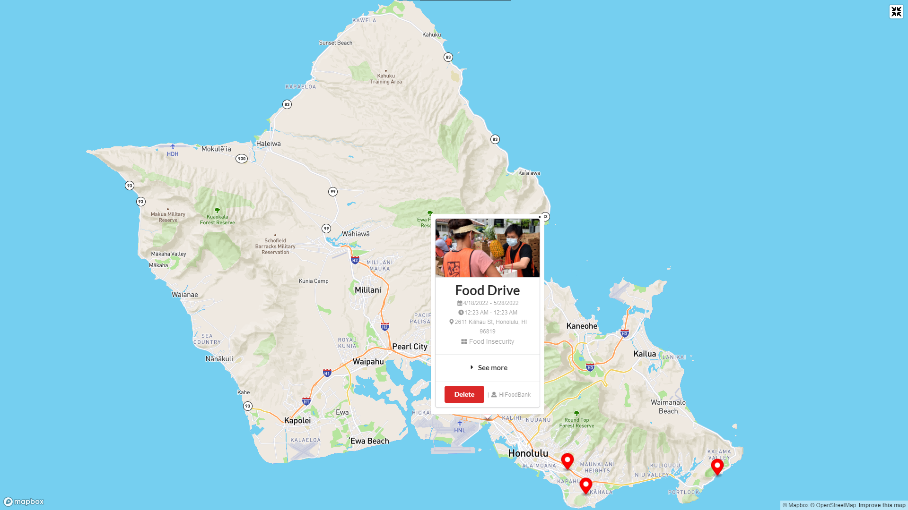

#### Calendar

Clicking the *View Calendar Schedule* button at the top of the Browse Opportunities page will display the schedule of each opportunity on a monthly, weekly, daily or agenda view:

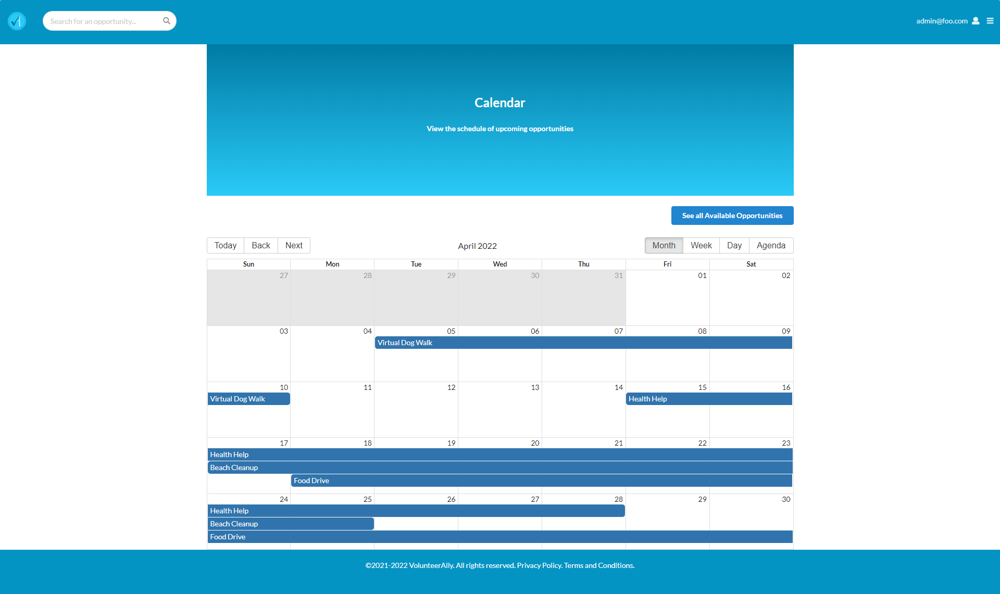

#### Opportunity Details page

One can view an individual opportunity to show more details about the listing:

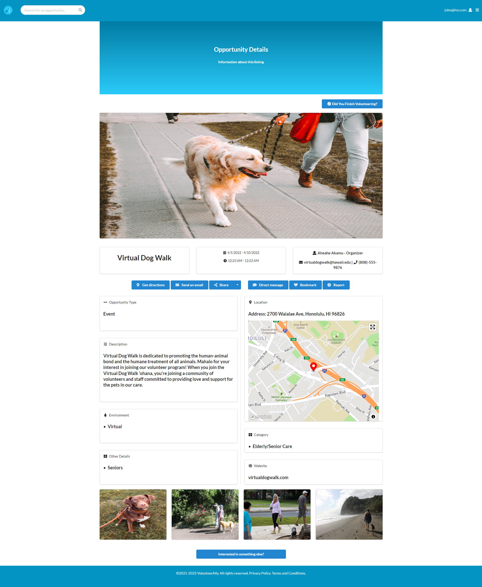

Included in this page are contact information, description of the event, a map of the event's location and gallery images of the event. Volunteers can share the listing on social media and bookmark them. 

#### Recording Hours Page

Volunteers can record their volunteering hours after an event has ended:

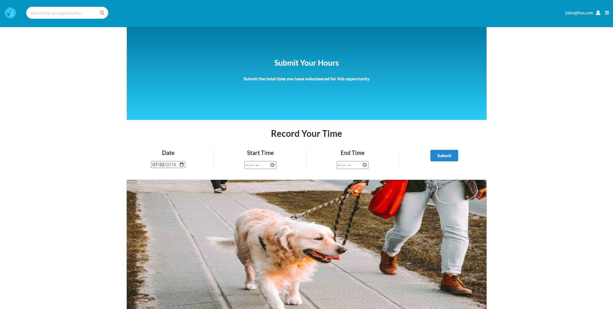

#### My Bookmarks page

Opportunities that have been bookmarked can be viewed on this page:

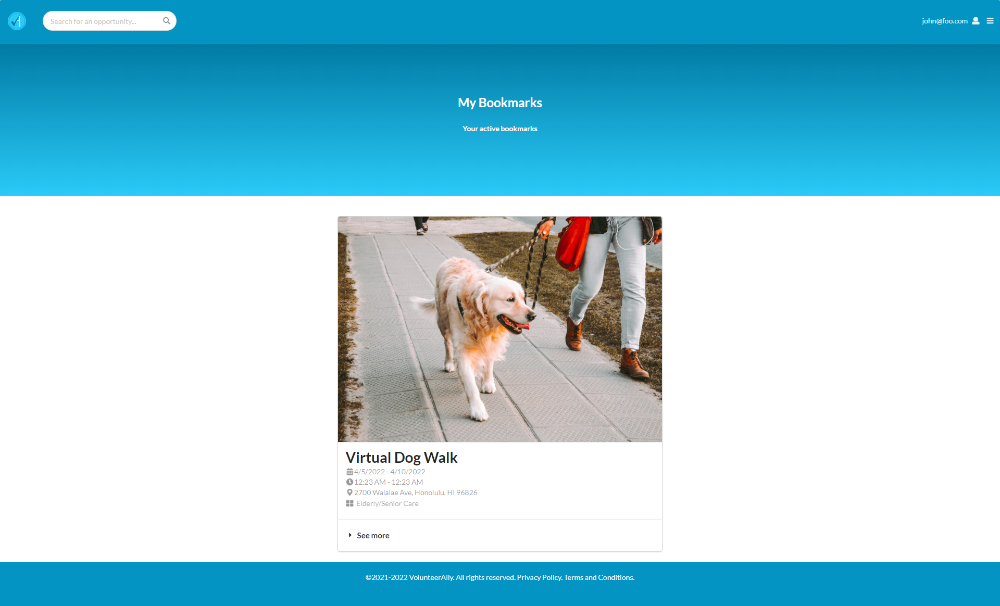

#### Volunteer Profile page

Volunteers can view or edit information about their profile:

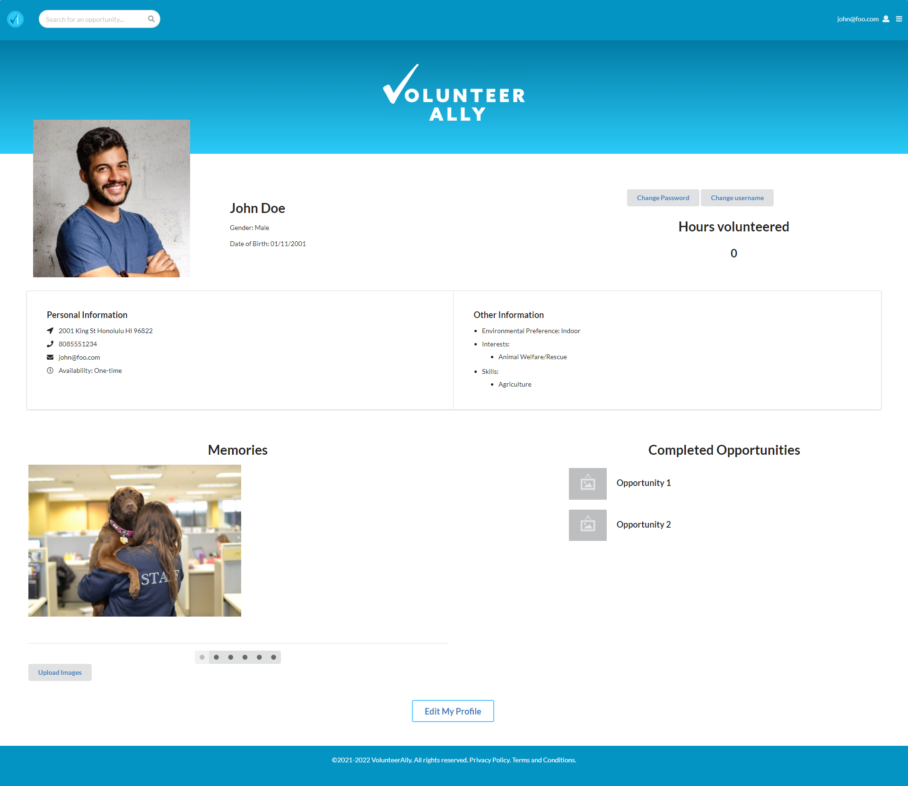

#### Edit Volunteer Profile page

A volunteer can edit their profile:

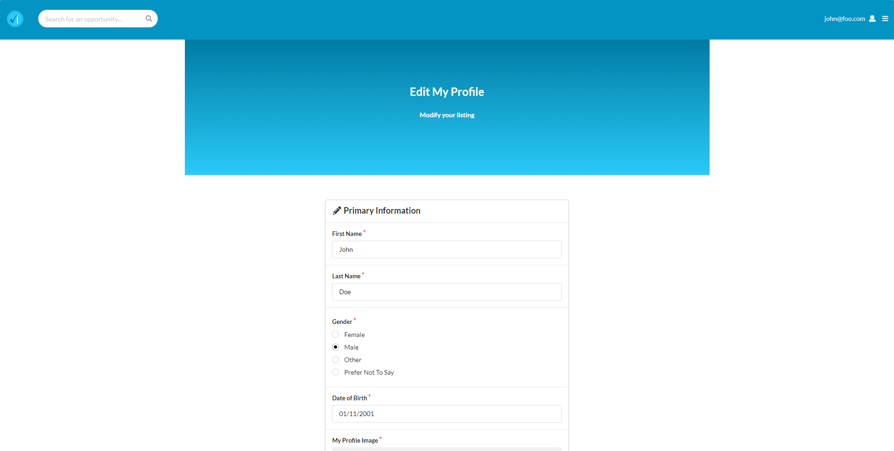

#### My Opportunity page

A logged-in organization can view just the opportunities that they have created: 

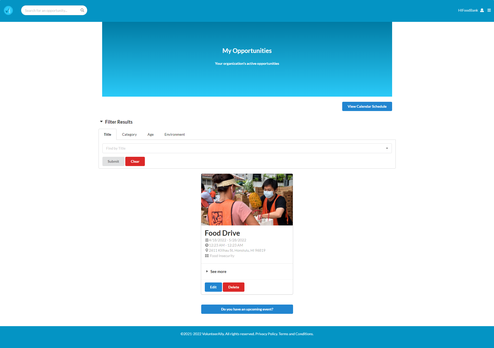

#### Add Opportunity page

Organizations can add a new opportunity:


#### Edit Opportunity page

An organization can edit their opportunity listing:

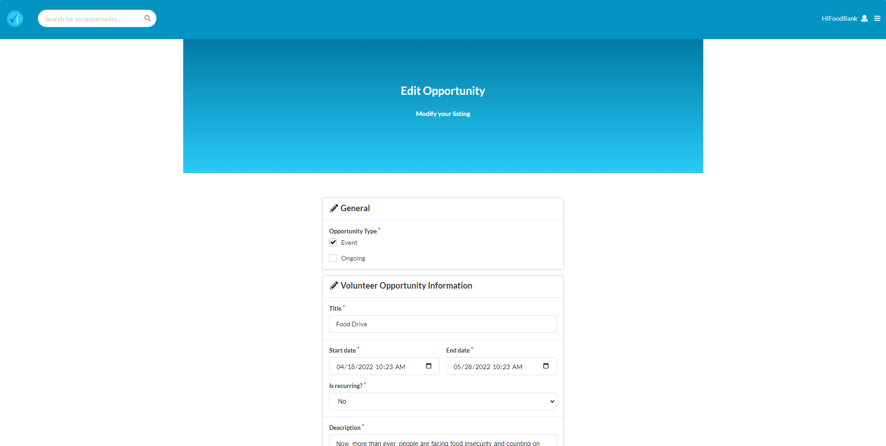

#### Organization Sign-up page

The Admin can add a new partner organization account:


#### Organization Profile page

Organizations can view or edit information about their profile:

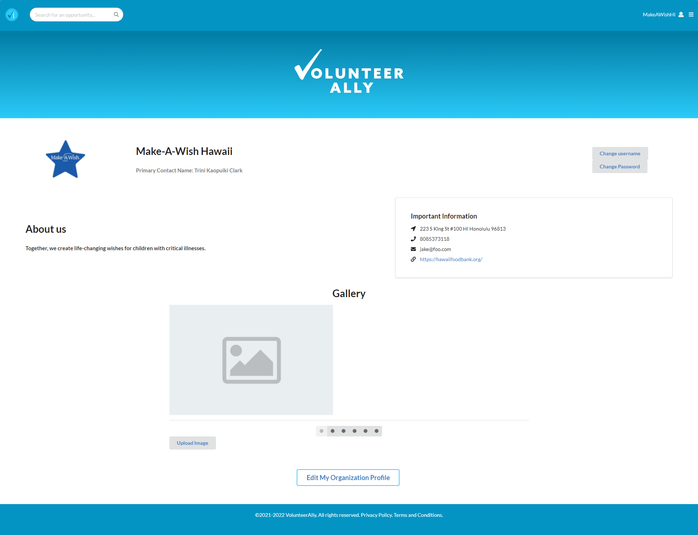

#### Edit Organization Profile page

An organization can edit their own profile:

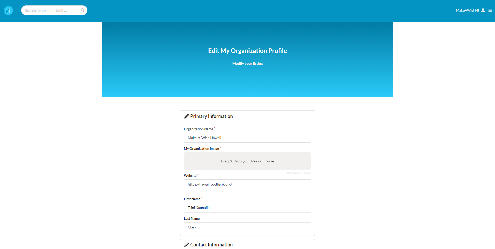

#### Organization Library page

This page displays all the organizations that have partnered with Volunteer Ally:

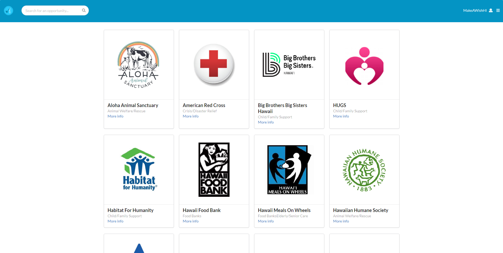

## Development History 

   * [Milestone 1 Project Board](https://github.com/aloha-time/aloha-time/projects/1)
   * [Milestone 2 Project Board](https://github.com/aloha-time/aloha-time/projects/2)
   * [Milestone 3 Project Board](https://github.com/aloha-time/aloha-time/projects/3)
   * [Milestone 4 Project Board](https://github.com/aloha-time/aloha-time/projects/5)
   * [Milestone 5 Project Board](https://github.com/aloha-time/aloha-time/projects/6)
   * [Milestone 6 Project Board](https://github.com/aloha-time/aloha-time/projects/7)

## The Team

  * [Chad Oshiro](https://chadoshiro.github.io/)
  * [Feimei Chen](https://feimeichen.github.io/)  
  * [Hansen Cabanero](https://hanseca.github.io/)
  * [Jonathan Valencia](https://jon-valencia.github.io/)
  * [Marissa Halim](https://marissahalim.github.io/)
  * [Quinn Bianchi-Lawson](https://quinnbl.github.io/)
  * [Rainier Javillo](https://rainllo.github.io/)
